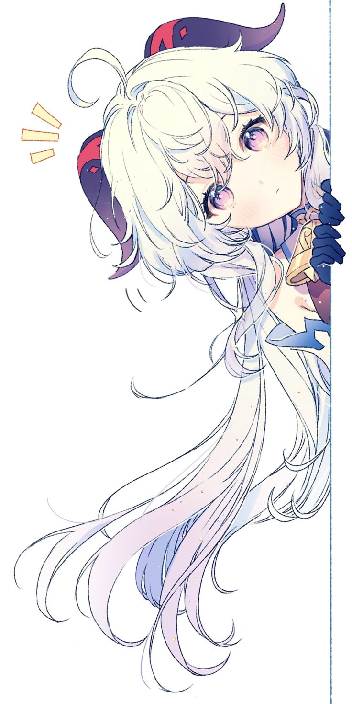

#

 

 
 
  
-  Vietnamese Dev 
-  I'm ~20 years old. ;-;
- 🎮 I used to playing some games : 
     
     [League of Legends](https://www.leagueoflegends.com/),  
     [Valorant](https://playvalorant.com/),  
     [Genshin Impact](https://genshin.hoyoverse.com/),  
     [Zenless Zone Zero](https://zenless.hoyoverse.com/)  

- I'm quite skilled with  JavaScript,  [NodeJS](https://nodejs.org/) and  TypeScript
- I can read and understand some code written in  [Java](https://www.java.com/en/) and  Flutter
- I’m currently learning  [Go](https://go.dev/)

 
<!--  -->
 
 
  
<!-- - 📗 [***aiko-chan-ai/discord.js-selfbot-v13***](https://github.com/aiko-chan-ai/discord.js-selfbot-v13)  
  An unofficial discord.js fork for creating selfbots
- 📘 [***aiko-chan-ai/DiscordBotClient***](https://github.com/aiko-chan-ai/DiscordBotClient)  
  A patched version of discord, with bot login support -->
 

   
 

<!-- 
  *“It's not bad for the leading actress to play a charming villain for a change ♪.” – Elysia* 

 -->

<!-- ## Discord -->
<!--  -->

<!-- ## My stats:

  

 -->

<!-- ## Commits -->

<!-- ## Star History

 -->

## Thanks for [aiko-chan-ai](https://github.com/aiko-chan-ai/aiko-chan-ai) ❤️
